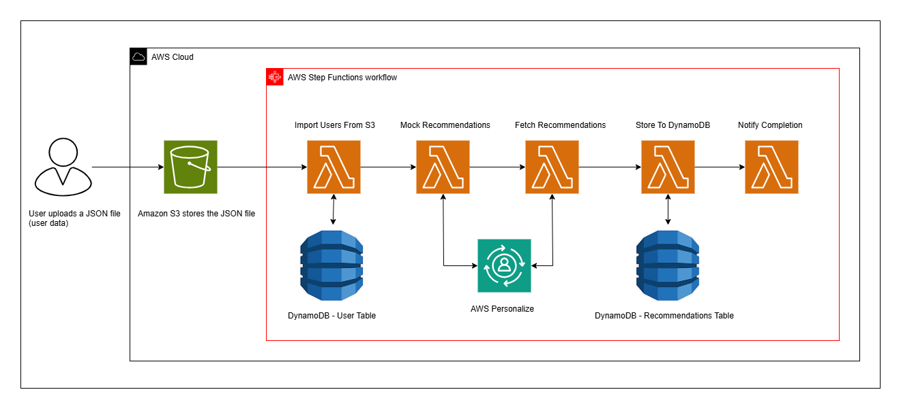
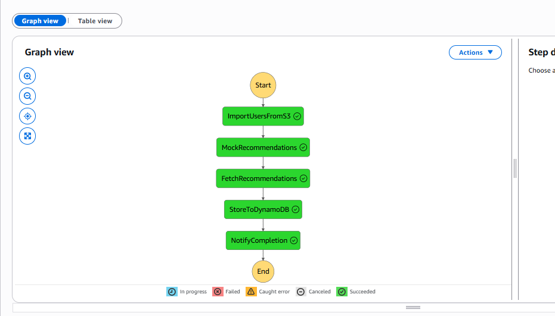
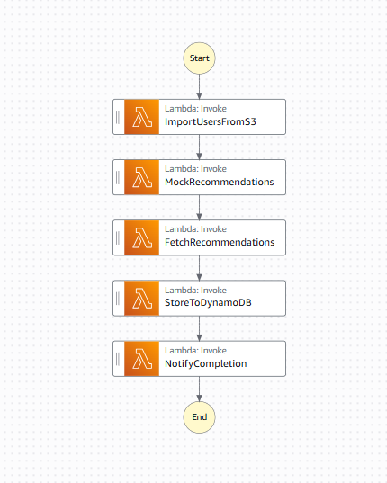
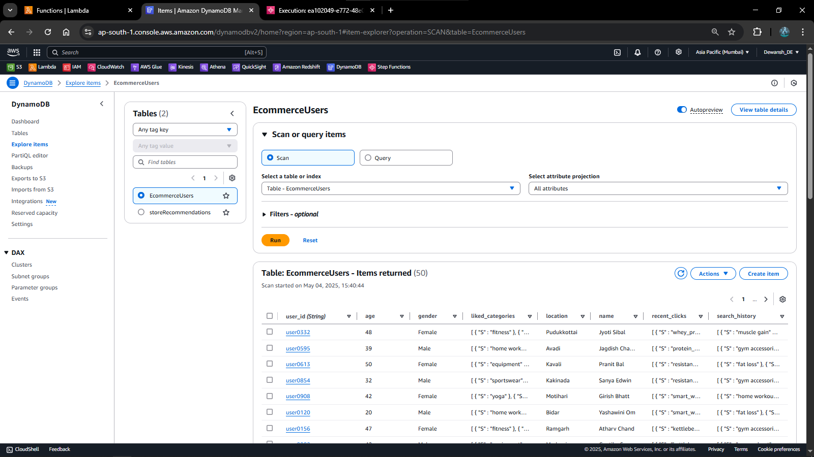
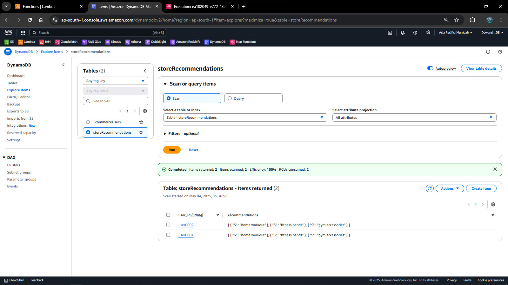
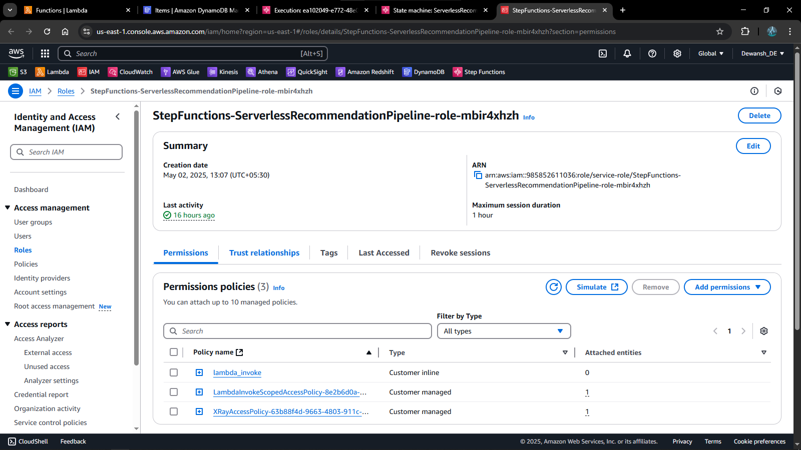

# 🧠 AWS-Based Personalized Recommendation System

A fully serverless, event-driven recommendation pipeline using AWS Step Functions, Lambda, Amazon Personalize, DynamoDB, and S3. The system generates product or content recommendations for users and stores them for real-time access.

---

## 📝 Project Overview

This project is designed to demonstrate a real-world personalized recommendation engine using AWS services. It simulates importing user data, generating personalized recommendations using AWS Personalize, and storing the results in DynamoDB — all orchestrated using Step Functions.

---

### 🧰 Tech Stack
AWS Lambda
Amazon S3
Amazon DynamoDB
AWS Step Functions
AWS Personalize
Python (boto3)

---

## 🎯 Objectives

- Create a fully serverless recommendation pipeline.
- Automatically generate and store user-specific product suggestions.
- Demonstrate orchestration using AWS Step Functions.
- Use Amazon Personalize to deliver dynamic recommendations.

---

## ⚙️ Architecture

### Services Used:
- **Amazon S3**: To store user data files.
- **AWS Lambda**: Handles all business logic in microsteps.
- **AWS Step Functions**: Orchestrates the entire workflow.
- **Amazon Personalize**: Generates actual recommendations.
- **Amazon DynamoDB**: Stores final results for querying.

---

## 🧩 Components

| Component              | Description |
|------------------------|-------------|
| `ImportUsersFromS3`     | Reads user data from S3 |
| `MockRecommendations`   | Generates mock or actual recommendations |
| `NotifyCompletion`      | Triggers a completion notification |
| `FetchRecommendations`  | Calls AWS Personalize campaign endpoint |
| `StoreToDynamoDB`       | Stores recommendations in DynamoDB |

---

## 📈 Data Flow

1. User data is read from **Amazon S3**
2. Step Function starts and triggers:
   - `ImportUsersFromS3`
   - `MockRecommendations` (or uses Personalize directly)
   - `FetchRecommendations` (calls `get_recommendations`)
   - `StoreToDynamoDB`
   - `NotifyCompletion`
3. Final recommendations stored in **DynamoDB**

---

### 🧪 Testing
Example event to trigger MockRecommendations Lambda:

{
  "userId": "user0001"
}

Example output stored in DynamoDB:

{
  "user_id": "user0001",
  "recommendations": ["home workout", "fitness bands", "gym accessories"]
}

---

### 📸 Screenshots

### 📸 Screenshots

> Visual proof of working modules & services

#### 🔄 Step Function Orchestration
- Complete execution flow (all Lambda steps):
  

#### 🧠 Lambda Functions
- All deployed Lambda functions:
  

#### 🗃️ DynamoDB Tables
- `EcommerceUsers` table entry:
  

- `storeRecommendations` table entry:
  

#### ☁️ Amazon S3
- Uploaded user data (`ecommerce_users.json`) preview:
  

#### 🔐 IAM Role Configuration
- IAM Role for Step Function:
  

- IAM Role for Lambda functions:
  

---	

### 💡 Conclusion
This project showcases a real-time, personalized recommendation workflow built entirely on AWS using serverless architecture. It's scalable, modular, and production-ready for e-commerce, fitness apps, media platforms, and more.